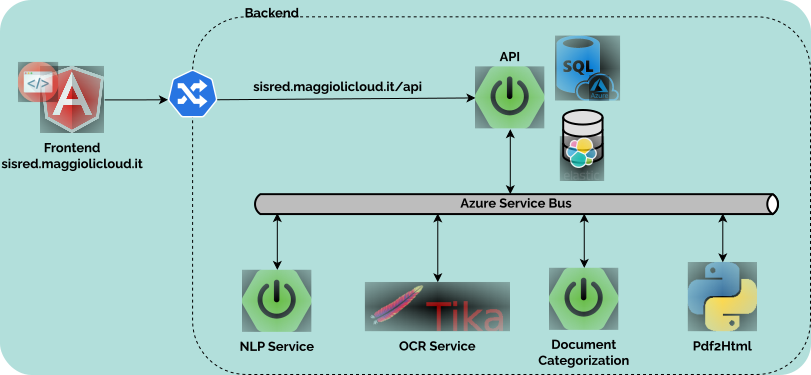

 
+++

title = "Development + Operations"
description = "No silos"
outputs = ["Reveal"]

[reveal_hugo]
transition = "slide"
transition_speed = "fast"
custom_theme = "custom-theme.scss"
custom_theme_compile = true

[reveal_hugo.custom_theme_options]
targetPath = "css/custom-theme.css"
enableSourceMap = true

+++

# 

## Development + Operations

### [Danilo Pianini](mailto:danilo.pianini@unibo.it)



---

{}

---

# A real-world test case

We applied DevOps (and microservice-ification) to an existing software project,
measuring some metrics *before* and *after* the operation.

* The detailed *experience report* has been presented at the 37th International Conference on Software Maintenance and Evolution ([ICSME 2021](https://icsme2021.github.io/)) 
    * [Scientific paper](https://doi.org/10.1109/ICSME52107.2021.00051)

---

{}

---

## The target

### Maggioli S.p.A

* *Multinational*, based in Italy
* *~2000 collaborators* at the time of writing
* An *internal IT/Operations* team
* Our target team was composed of **five people**

### sisred (before intervention)

* *Client-server* stand-alone application
* *Delphi* front-end, *Microsoft SQL Server* backend
* Editors (paid by Maggioli) are *experts in law entering information on the client*
* The information is the exposed into a (paid access) *portal* with up-to-date legal information

---

## Previous architecture

---

#

| Metric         | Prev.           | Now  | Change |
| :-------------|:-------------:| :-----:| ---: |
| Release frequency ($\frac{releases}{day}$) | [0.071]() | 
| Commit to release time (hours) |   [8 to 24]() | 
| Commits per day ($\frac{commits}{day}$) | [2]() | 
| MTTR (hours) | [36]() | 
| Prod. env. setup (working hours) | [16]() | 
| Dev. env. setup (minutes) | [120]() |
| Nightly downtime ($\frac{minutes}{night}$) | [30]() | 
| Support ticket frequency ($\frac{tickets}{month}$) | [40]() | 
| Issue resolution time (days) | [4]() |  | 

---

## Microservice-ified architecture

---

## CI Pipeline

---

## Timeline

---



| Metric         | Prev.           | Now  | Change |
| :-------------|:-------------:| :-----:| ---: |
| Release frequency ($\frac{releases}{day}$) | [0.071]() | *2.7* | **+3700%**
| Commit to release time (hours) |   [8 to 24]() | 
| Commits per day ($\frac{commits}{day}$) | [2]() | 
| MTTR (hours) | [36]() | 
| Prod. env. setup (working hours) | [16]() | 
| Dev. env. setup (minutes) | [120]() |
| Nightly downtime ($\frac{minutes}{night}$) | [30]() | 
| Support ticket frequency ($\frac{tickets}{month}$) | [40]() | 
| Issue resolution time (days) | [4]() |  | 

---



| Metric         | Prev.           | Now  | Change |
| :-------------|:-------------:| :-----:| ---: |
| Release frequency ($\frac{releases}{day}$) | [0.071]() | *2.7* | **+3700%**
| Commit to release time (hours) |   [8 to 24]() | *0.19* | **~ -98.5%**
| Commits per day ($\frac{commits}{day}$) | [2]() | 
| MTTR (hours) | [36]() | 
| Prod. env. setup (working hours) | [16]() | 
| Dev. env. setup (minutes) | [120]() |
| Nightly downtime ($\frac{minutes}{night}$) | [30]() | 
| Support ticket frequency ($\frac{tickets}{month}$) | [40]() | 
| Issue resolution time (days) | [4]() |  | 

---



| Metric         | Prev.           | Now  | Change |
| :-------------|:-------------:| :-----:| ---: |
| Release frequency ($\frac{releases}{day}$) | [0.071]() | *2.7* | **+3700%**
| Commit to release time (hours) |   [8 to 24]() | *0.19* | **~ -98.5%**
| Commits per day ($\frac{commits}{day}$) | [2]() | *7.1* | **+255%**
| MTTR (hours) | [36]() | 
| Prod. env. setup (working hours) | [16]() | 
| Dev. env. setup (minutes) | [120]() |
| Nightly downtime ($\frac{minutes}{night}$) | [30]() | 
| Support ticket frequency ($\frac{tickets}{month}$) | [40]() | 
| Issue resolution time (days) | [4]() |  | 

---



| Metric         | Prev.           | Now  | Change |
| :-------------|:-------------:| :-----:| ---: |
| Release frequency ($\frac{releases}{day}$) | [0.071]() | *2.7* | **+3700%**
| Commit to release time (hours) |   [8 to 24]() | *0.19* | **~ -98.5%**
| Commits per day ($\frac{commits}{day}$) | [2]() | *7.1* | **+255%**
| MTTR (hours) | [36]() | *0.5* | **-98.6%**
| Prod. env. setup (working hours) | [16]() | 
| Dev. env. setup (minutes) | [120]() |
| Nightly downtime ($\frac{minutes}{night}$) | [30]() | 
| Support ticket frequency ($\frac{tickets}{month}$) | [40]() | 
| Issue resolution time (days) | [4]() |  | 

---



| Metric         | Prev.           | Now  | Change |
| :-------------|:-------------:| :-----:| ---: |
| Release frequency ($\frac{releases}{day}$) | [0.071]() | *2.7* | **+3700%**
| Commit to release time (hours) |   [8 to 24]() | *0.19* | **~ -98.5%**
| Commits per day ($\frac{commits}{day}$) | [2]() | *7.1* | **+255%**
| MTTR (hours) | [36]() | *0.5* | **-98.6%**
| Prod. env. setup (working hours) | [16]() | *0.35* | **-97.8%**
| Dev. env. setup (minutes) | [120]() |
| Nightly downtime ($\frac{minutes}{night}$) | [30]() | 
| Support ticket frequency ($\frac{tickets}{month}$) | [40]() | 
| Issue resolution time (days) | [4]() |  | 

---



| Metric         | Prev.           | Now  | Change |
| :-------------|:-------------:| :-----:| ---: |
| Release frequency ($\frac{releases}{day}$) | [0.071]() | *2.7* | **+3700%**
| Commit to release time (hours) |   [8 to 24]() | *0.19* | **~ -98.5%**
| Commits per day ($\frac{commits}{day}$) | [2]() | *7.1* | **+255%**
| MTTR (hours) | [36]() | *0.5* | **-98.6%**
| Prod. env. setup (working hours) | [16]() | *0.35* | **-97.8%**
| Dev. env. setup (minutes) | [120]() | *9* | **-92.5%**
| Nightly downtime ($\frac{minutes}{night}$) | [30]() | 
| Support ticket frequency ($\frac{tickets}{month}$) | [40]() | 
| Issue resolution time (days) | [4]() |  | 

---



| Metric         | Prev.           | Now  | Change |
| :-------------|:-------------:| :-----:| ---: |
| Release frequency ($\frac{releases}{day}$) | [0.071]() | *2.7* | **+3700%**
| Commit to release time (hours) |   [8 to 24]() | *0.19* | **~ -98.5%**
| Commits per day ($\frac{commits}{day}$) | [2]() | *7.1* | **+255%**
| MTTR (hours) | [36]() | *0.5* | **-98.6%**
| Prod. env. setup (working hours) | [16]() | *0.35* | **-97.8%**
| Dev. env. setup (minutes) | [120]() | *9* | **-92.5%**
| Nightly downtime ($\frac{minutes}{night}$) | [30]() | *0* | **-100%**
| Support ticket frequency ($\frac{tickets}{month}$) | [40]() | 
| Issue resolution time (days) | [4]() |  | 

---



| Metric         | Prev.           | Now  | Change |
| :-------------|:-------------:| :-----:| ---: |
| Release frequency ($\frac{releases}{day}$) | [0.071]() | *2.7* | **+3700%**
| Commit to release time (hours) |   [8 to 24]() | *0.19* | **~ -98.5%**
| Commits per day ($\frac{commits}{day}$) | [2]() | *7.1* | **+255%**
| MTTR (hours) | [36]() | *0.5* | **-98.6%**
| Prod. env. setup (working hours) | [16]() | *0.35* | **-97.8%**
| Dev. env. setup (minutes) | [120]() | *9* | **-92.5%**
| Nightly downtime ($\frac{minutes}{night}$) | [30]() | *0* | **-100%**
| Support ticket frequency ($\frac{tickets}{month}$) | [40]() | *19* | **-52.5%**
| Issue resolution time (days) | [4]() |  | 

---



| Metric         | Prev.           | Now  | Change |
| :-------------|:-------------:| :-----:| ---: |
| Release frequency ($\frac{releases}{day}$) | [0.071]() | *2.7* | **+3700%**
| Commit to release time (hours) |   [8 to 24]() | *0.19* | **~ -98.5%**
| Commits per day ($\frac{commits}{day}$) | [2]() | *7.1* | **+255%**
| MTTR (hours) | [36]() | *0.5* | **-98.6%**
| Prod. env. setup (working hours) | [16]() | *0.35* | **-97.8%**
| Dev. env. setup (minutes) | [120]() | *9* | **-92.5%**
| Nightly downtime ($\frac{minutes}{night}$) | [30]() | *0* | **-100%**
| Support ticket frequency ($\frac{tickets}{month}$) | [40]() | *19* | **-52.5%**
| Issue resolution time (days) | [4]() | *3* | **-25%**

---

## Benefits

* Much less **maintenance** in the traditional meaning: *"Time spent to keep the system in nominal conditions"*
    * No more issues with Windows updates
    * No more downtimes related to internal network / electricity / public infrastructure maintenance
    * Improved security
    * No more critical failures caused by testing stored procedures directly in production my mistake
* Much more maintenance in terms of *software evolution*
    * Application (or verification of automatic application) of updates
    * Security audits
    * Maintenance and update of the pipeline

---

## Lessons learned

* The teams must be **autonomous**
* Practices must be *tailored* to the team
* Time-consuming, repetitive, and cumbersome procedures must be *automated*
* Obsolete practices must be *removed*
* **Communication** is key, awareness must be shed across the team of the expected benefits

