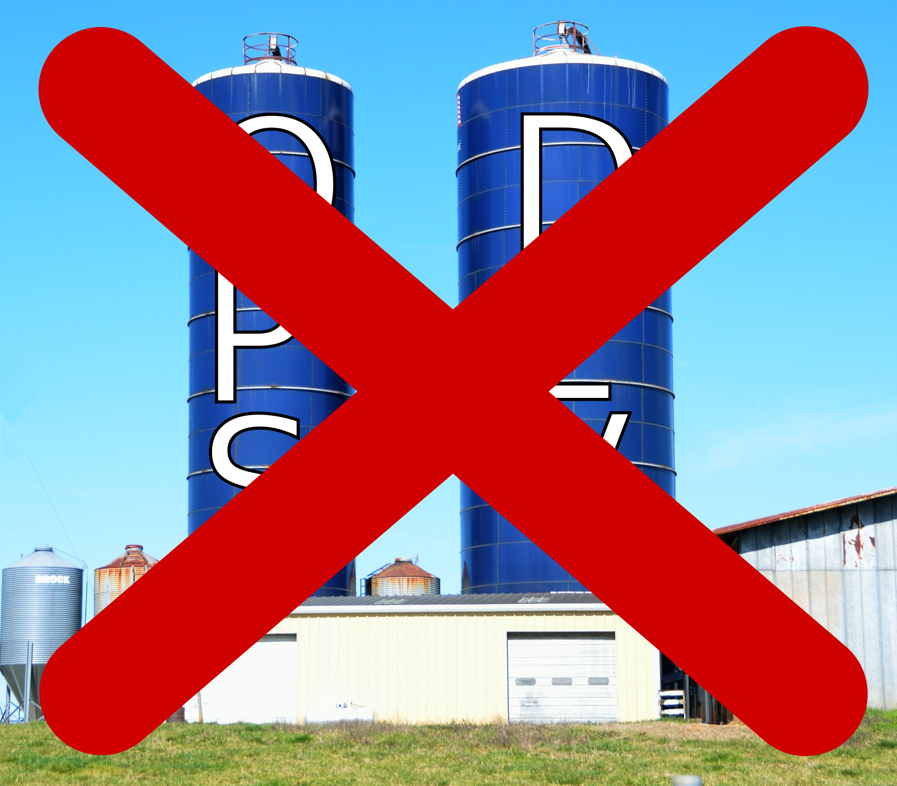
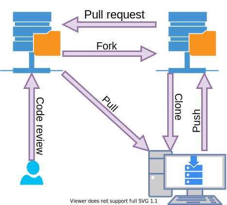

+++

title = "Development and Operations"
description = "Introduction to DevOps"
outputs = ["Reveal"]

[reveal_hugo]
transition = "slide"
transition_speed = "fast"
custom_theme = "custom-theme.scss"
custom_theme_compile = true

[reveal_hugo.custom_theme_options]
targetPath = "css/custom-theme.css"
enableSourceMap = true

+++

# Laboratory of Software Systems

## Development and operations

### [Danilo Pianini](mailto:danilo.pianini@unibo.it)

---

# Development

* Analysis of a domain
* Design of a solution
* Implementation
* Testing

---

# Operations

* IT infrastructure
* Deployment
* Maintenance

---

# Silo mentality

---

# **No** silos

---

# The DevOps culture

* **Increased collaboration**
  * Dev and Ops should *exchange information* and *work together*

* **Shared responsibility**
  * A team is responsible for the (sub) product for its *whole lifetime*
  * *No handing over* projects from devs to ops

* **Autonomous teams**
  * *Lightweight decision making* process
  * Minimization of manual interventions

* **Focus on the process, not just the product**
  * Promote small, *incremental changes*
  * *Automate* as much as possible
  * Leverage the right *tool* for the job at hand

---

# DevOps principles

* Collaboration
* Reproducibility
* Automation
* Incrementality
* Robustness

---

# DevOps practices

* Workflow organization
* Self-testing code
* Code quality control
* Continuous Integration
* Continuous Delivery
* Continuous Deployment
* Continuous Monitoring

---

# DevOps tools

* Version control systems
  * Reproducible project history
  * Enable several workflows

* Workflow management tools
  * Tracking of progress, issues, proposals
  * Activities are linked to code

* Build automators
  * Compile, test, and run QA on software

* Continuous Integration platforms
  * Run the automation pipeline on reference environments
  * Promotes infrastructure as code

---

# Why bother?

1. **Risk management**
    * Reduce the probability of *failure*
    * Detect *defects* before hitting the market
    * Quickly *react* to problems

2. **Resource exploitation**
    * Use *human resources* for human-y work
    * Reduce *time to market*
    * Embrace *innovation*
    * Exploit *emerging technologies*

---

# Workflow organization

* Participants should have clear roles
* Lifecycle phases should be mapped into the workflow

---

## Gitflow

---

## Forks and pull requests

---

# Self-testing code

#### **Code includes tests**

* Several testing levels
    * Unit, acceptance, integration, etc.
* Testing is **entirely automated**
* Solving an issue implies the creation of a *regression test*
* Tests are executed *for every change*

---

# Code quality control

#### **Code is coherent and understandable**

* Consistent code style across the board
    * Improved readability
    * Much cleaner diffs
    * Improved bisection / regression tracking
* Complete documentation
    * Newbies can be productive more quickly
* A large part of code QA can be automated!

---

# Continuous integration

#### **Code must not diverge**

* Working copies are *kept in sync* with the mainline
    * How to strictly relaes with the workflow organization
* Build and test *automatically* on a fresh machine
* Build and test *on all the target platforms*
* Promptly intercept (feedback) failures and issues
* Deploy successful artifacts

---

# Continuous integration

#### **Risk reduction**

---

# Continuous Delivery 

#### **Every working build should produce a potential release**

* The CI pipeline should produce final artifact
* Artifacts should be available for quick deployment

---

# Continuous Deployment

#### **Actual deployment should be automatic**

* There should be a strategy for delivered code to enter in production
* The infrastructure should be defined 

---

# DevOps at work

### An internal project where techniques are applied

* ["Truth" Repository](https://github.com/AlchemistSimulator/Alchemist/)
* [Branches](https://github.com/AlchemistSimulator/Alchemist/branches)
* [Forks](https://github.com/AlchemistSimulator/Alchemist/network/members)
* [Example pull request](https://github.com/AlchemistSimulator/Alchemist/pull/469)
* [Example automatic update](https://github.com/AlchemistSimulator/Alchemist/pull/479)
* [CI/CD pipeline](https://travis-ci.org/github/AlchemistSimulator/Alchemist)
* [(Build) Infrastructure as code](https://github.com/AlchemistSimulator/Alchemist/blob/develop/.travis.yml)
