 
+++

title = "Advanced Versioning Techniques"
description = "Submodules, rebasing, squashing, cherry-picking"
outputs = ["Reveal"]

[reveal_hugo]
transition = "slide"
transition_speed = "fast"
custom_theme = "custom-theme.scss"
custom_theme_compile = true

[reveal_hugo.custom_theme_options]
targetPath = "css/custom-theme.css"
enableSourceMap = true

+++

# Advanced Versioning Techniques

{}

---

# Annotated Tagging

Git supports two types of tags:
* **lightweight** tags
    * *default option*
    * simply a name for an object (usually a commit)
    * meant for creating **private** or **temporary** annotations!
* **annotated** tags
    * Produced with `-a` (unsigend), `-s`, or `-u` options
    * Creates a *new object*
    * Contain *message*, *creation date*, *tagger name* and *email*, and an optional *signature*
    * Annotated tags are **meant for release**
    * Some commands (most notably, `git describe`) ignore lightweight tags by default

---

# Signing commits

Nice people *signs* commits, certifying their authorship.

* Signed commits appear with a  on GitHub

If you do not have a signature yet, [time to create one](https://central.sonatype.org/pages/working-with-pgp-signatures.html)
* Creation: `gpg --gen-key`
* List: `gpg --list-keys`
* Distribution: `gpg --keyserver hkp://pool.sks-keyservers.net --send-keys`

Once you have a private key to sign with, you can configure Git to use it for signing things by setting the user.signingkey config setting.

`git config --global user.signingkey <YOUR_KEY_ID>`

---

# Stashing

Classic situation:
1. Work on some project, have the project in inconsistent state
2. Something needs to be fixed on another branch

$\Rightarrow$ You don't want to have commits half-way, but you can't lose what you have done...

## `git stash` to the rescue

Stashing takes the dirty state of the working directory and saves it on a **stack** of *unfinished changes* that you can *reapply at any time*
  * application on different branches allowed!

---

## Practical stashing

* `git stash`
  * **Pushes** *all* dangling changes (staged or unstaged) to the stash
* `git stash list`
  * **Shows** all the accumulated stashes
* `git stash apply [stash@{N}] [--index]`
  * No option specified: **Re-applies**, *without removing* from the stash, the *latest* stashed change
  * If `stash@{N}`, applies the *N-th* stashed change
  * If `--index` is specified, the changes that were staged at the time of push get *re-staged*
* `git stash drop stash@{N}`
  * **Deletes** the *N-th* stashed change
* `git stash pop`
  * **Re-applies** *the most recent* stash, *removing* it from the stash
  * Same as `git stash apply && git stash drop stash@{0}`

---

## Merging

* In classic merging, diverging branches are reconciled through a **merge commit**

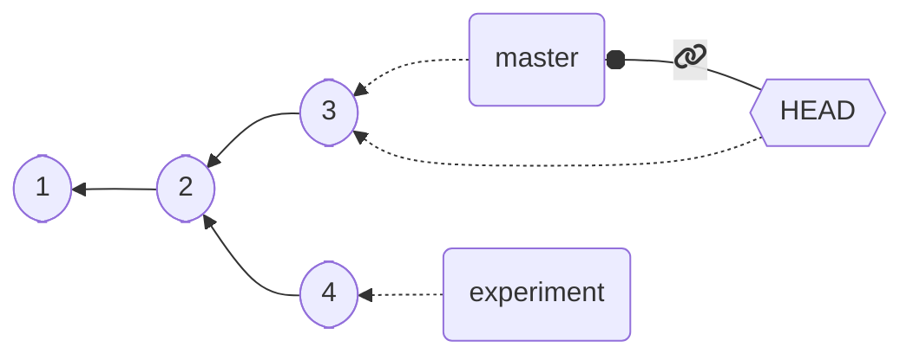

---

## Merging

`git merge experiment`

{}

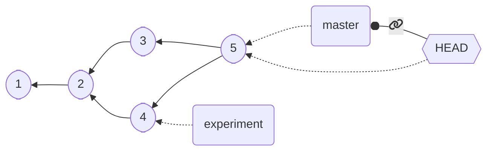

{}

---

# Advanced merging: rebase

* Merging is not the only way to reunite diverging branches
* We may want, for instance, to simulate that `4` was developed after `3`
    * For instance, because it was on a separate part of the codebase
* Merging *forces* to record the creation and reunion of a development line, but in some cases it may be undesirable
    * Project history *hard to understand* because of too many merges
    * The separation was actually a successful small experiment

**Rebasing** provides a way to alter the project history by *changing the parent*  of (re-base) existing commits

---

## Rebase merge


{}

`git checkout experiment && git rebase master`

{}

---

## Rebase merge

`git checkout experiment && git rebase master`

{}

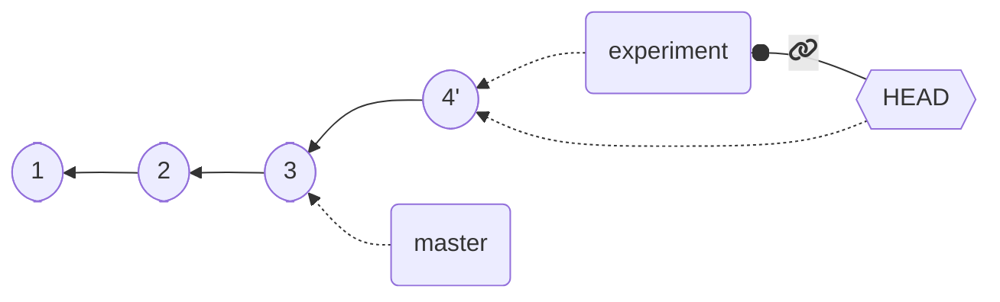

{}

{}

`git checkout master && git merge`

{}

---

## Fast-forwarding after a rebase

`git checkout master && git merge`

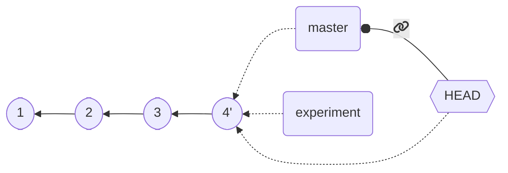

*fast-forward!*

---

## Advanced rebasing

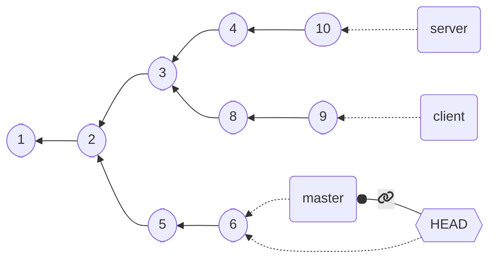

We want to leave `server` as is, but rebase `client` onto `master`

{}

Option `--onto` can be used to transplant entire branches
* `git rebase --onto destination start end`
    * pick commits from `start` to `end`
    * reply them starting from `destination`

{}

---

## Advanced rebasing

`git rebase --onto master server client`

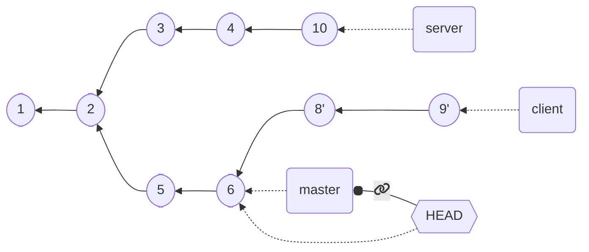

Reads: *pick all commits from `server` (excluded) to `client` (included), remove them and reply them starting from `master`*

Or: *pick all commits from `client`, remove all those in `server`, then and reply them starting from `master`*

---

# Rebase pull

`pull` is a non-atomic operation:
1. `git fetch`
2. `git merge FETCH_HEAD`

There is no reason why the operation of branch joining must be `merge`: it could well be `rebase`!

1. `git fetch`
2. `git rebase FETCH_HEAD`

*Both operations* are actually supported! The full commands would be:
* `git pull --merge` $\Rightarrow$ default behaviour (in old `git` versions)
* `git pull --rebase` $\Rightarrow$ reunite using rebase!

**Note:** new versions of git require configuration and do not start with merge as default!
* `git config --global pull.rebase [true/false]`

---

# Perils of rebasing

> **Do not rebase commits that exist outside your repository**

Rebasing *rewrites the project history* and as such generates *incompatible histories*
* Remote pushes may get *refused*!
* pushing with `--force` *rewrites history remotely* and **may delete other people's commits**!
* `git pull --rebase` is safe, if the local commits where never pushed in any remote
    * It is actually a good practice to default to it
    * `git config --global pull.rebase true`

---

# Rebasing or merging?

Select depending on what you *conceptually* want:
* I want to **record of what actually happened**: then **merge**
    * History is preserved
    * Messy commits are there
* I want to **tell the story of how your project was made**: then **rebase**
    * History is *modified*
    * Commits are cleaner

They tell two stories:
* *rebase* is the book
* *merge* is the story of how the book was written

---

# Squashing

Squashing is the practice of *reassembling multiple commits into a single one*
* Allows to forget "experimental" commits
* Allows to merge temporary changes into a single one 
* *Simplifies* history
* *Alters* history
* Can be performed via `merge` or manually

---

# Squashing manually


  digraph G {
    rankdir=LR;
    rankdir=LR;
    C1 -> C2 -> C3 -> C4 -> C5 -> C6 [dir=back];
    HEAD [style="filled,solid", shape=box, fillcolor=orange];
    C6 -> HEAD [dir=back, penwidth=4, color=orange];
  }

`git reset --soft HEAD~4`

  digraph G {
    graph[splines=ortho]
    rankdir=LR;
    C1
    C1 -> C2  [dir=back]
    {rank=same; C2, HEAD}
    HEAD [style="filled,solid", shape=box, fillcolor=orange];
    C3 [style=dashed];
    C4 [style=dashed];
    C5 [style=dashed];
    C6 [style=dashed];
    C2 -> C3 -> C4 -> C5 -> C6 [style=dashed, dir=back];
    rankdir=LR;
    C2 -> HEAD [dir=back, weight=0, penwidth=4, color=orange];
  }

`git commit`

  digraph G {
    rankdir=LR;
    C1 -> C2 -> "C3'" [dir=back];
    HEAD [style="filled,solid", shape=box, fillcolor=orange];
    "C3'" [style=filled, fillcolor=red]
    "C3'" -> HEAD [dir=back, penwidth=4, color=orange];
  }


---

# Squashing with merge


  digraph G {
    rankdir=LR;
    C1 -> C2 -> C3 -> C4 -> C5 -> C6 [dir=back];
    HEAD [style="filled,solid", shape=box, fillcolor=orange];
    master [style="filled,solid", shape=box, fillcolor=orange];
    {rank=same; master, HEAD}
    C6 -> HEAD [dir=back, penwidth=4, color=orange];
    C6 -> master [dir=back, penwidth=4, color=orange];
  }

`git branch target`

  digraph G {
    rankdir=LR;
    C1 -> C2 -> C3 -> C4 -> C5 -> C6 [dir=back];
    HEAD [style="filled,solid", shape=box, fillcolor=orange];
    master [style="filled,solid", shape=box, fillcolor=orange];
    target [style="filled,solid", shape=box, fillcolor=orange];
    {rank=same; master, target, HEAD}
    C6 -> HEAD [dir=back, penwidth=4, color=orange];
    C6 -> master [dir=back, penwidth=4, color=orange];
    C6 -> target [dir=back, penwidth=4, color=orange];
  }

`git reset --hard HEAD~4`

  digraph G {
    rankdir=LR;
    master [style="filled,solid", shape=box, fillcolor=orange];
    C1 -> C2 -> C3 -> C4 -> C5 -> C6 [dir=back];
    HEAD [style="filled,solid", shape=box, fillcolor=orange];
    target [style="filled,solid", shape=box, fillcolor=orange];
    {rank=same; C2, master}
    {rank=same; C3, HEAD}
    C2 -> HEAD [dir=back, penwidth=4, color=orange];
    C2 -> master [dir=back, penwidth=4, color=orange];
    C6 -> target [dir=back, penwidth=4, color=orange];
  }


---

# Squashing with merge


  digraph G {
    rankdir=LR;
    master [style="filled,solid", shape=box, fillcolor=orange];
    C1 -> C2 -> C3 -> C4 -> C5 -> C6 [dir=back];
    HEAD [style="filled,solid", shape=box, fillcolor=orange];
    target [style="filled,solid", shape=box, fillcolor=orange];
    {rank=same; C2, master}
    {rank=same; C3, HEAD}
    C2 -> HEAD [dir=back, penwidth=4, color=orange];
    C2 -> master [dir=back, penwidth=4, color=orange];
    C6 -> target [dir=back, penwidth=4, color=orange];
  }

`git merge --squash target`

  digraph G {
    compound=true;
    rankdir=LR;
    master [style="filled,solid", shape=box, fillcolor=orange];
    C1 -> C2 [dir=back]
    C2 -> C3 [weight=2, dir=back]
    C2 -> "C3'" [weight=1]
    "C3'" [style=filled, fillcolor=red]
    subgraph cluster_0 {
        C3 -> C4 -> C5 -> C6 [dir=back];
        color=red
        style=dashed
    }
    "C3'" -> C4 [lhead=cluster_0, style="dashed", dir=back, color=red]
    HEAD [style="filled,solid", shape=box, fillcolor=orange];
    target [style="filled,solid", shape=box, fillcolor=orange];
    "C3'" -> HEAD [dir=back, penwidth=4, color=orange];
    "C3'" -> master [dir=back, penwidth=4, color=orange];
    C6 -> target [dir=back, penwidth=4, color=orange];
    {rank=same; C2, master}
    {rank=same; "C3'", HEAD}
  }

`git branch -d target`

  digraph G {
    rankdir=LR;
    C1 -> C2 -> "C3'" [dir=back];
    HEAD [style="filled,solid", shape=box, fillcolor=orange];
    "C3'" [style=filled, fillcolor=red]
    "C3'" -> HEAD [dir=back, penwidth=4, color=orange];
    master [style="filled,solid", shape=box, fillcolor=orange];
    "C3'" -> master [dir=back, penwidth=4, color=orange];
  }


---

# Squash, merge, or rebase?

Squashing results in *further alteration* than rebase

**Merge** when you want to *retain history*, keeping track of what happened

**Rebase** only when you are the only one with the commits, to favor *linearity*

**Squash** when some of the commits are somewhat "tests", points in time you do not want to get back to anyway

---

# Cherry picking

Selecting and importing a single commit (or commit range) from another branch

`git cherry-pick <tree-ish>`
* Picks `<tree-ish>` and adds it to `HEAD`
* If `<tree-ish>` is a branch name, cherry picks the last commit of the branch

`git cherry-pick from..to`
* cherry picks commit range from ref `from` to ref `to`

Cherry picking is often useful for applying *fixes* or *patches* which are in development from other branches.

---

# Submodules

Using *a repository within another repository*

Typical use:
* *Templating*
    * see e.g. these slides
* *Aggregation*
    * A "master project" working as container of multiple other projects
* A *direct dipendency* on an unreleased or in-development library
* The project cannot be managed with an *integrated hierarchial tool*
    * No Gradle or Maven or similar
    * If a build tool can deal with dependencies, then let it do its job

---

# Git Submodule

Adding an external submodule:
* `git submodule add <REPO_URL> <DESTINATION>`
    * *Prefer HTTPS*: SSH requires public key authorization, and hosts have limitations
    * Creates or modifies the `.gitmodules` file in the repository root
    * Creates a new special file `<DESTINATION>`
    * Both `.gitmodules` and `<DESTINATION>` **must be tracked**
    * Clones the current repository status at `<DESTINATION>`
* Contents of the submodules **are not tracked**, but **linked**
* A project can have *multiple* submodules
* *Nested* submodules are possible

---

## Importing a repository with submodules

A plain `clone` does not initialize submodules. Special care applies.

`git clone --recurse-submodules <URL> <DESTINATION>`
* Besides performing the clone, also recursively initialize submodules

If the repository has been cloned plainly, then submodules can be initialized manually

`git submodule update --init --recursive`

---

## Working with submodules

`git submodule update --remote --recursive`
* Recursively updates all submbodules
* It *must* be executed also **after a pull**
    * *Pulling does not update submodules by default*

Changes into submodules are dealt with as if they were on a *separate repository*

`foreach` can be used to *run some command on all modules*
* e.g., `git submodule foreach git pull`
* *recursive behavior* can be obtained with `--recurse-submodules`

---

## Moving and removing submodules

* `git mv path/to/submodule`
* `git rm path/to/submodule`

They allow, respectively, to move/remove an existing submodule
* a *modern* version of git is required (introduced in 2022)

---

## Removing submodules (legacy)

No single built-in command in old versions of git :

1. De-init the submodule

`git submodule deinit -f -- sub/module/path`

2. Cleanup the submodule worktree (otherwise, it will be impossible to re-add the module in future, as the repository will appear corrupted)

`rm -rf .git/modules/sub/module/path`

3. Remove the files from the work tree

`git rm -f sub/module/path`

**Note**: Do not use a trailing slash on the submodule path when using these commands!

---

## Who did this? Complimenting (or blaming) people

### `git blame`

Shows what revision and author last modified each line of a file

* `git blame foo`
  * shows who changed file `foo`, line by line
* `git blame -L 16,42 foo`
   * shows who changed lines 16 to 42 in `foo`

* It is possible to use a regular expression as an argument to `-L`,
finding who did something specific

---

## Mining lost commits

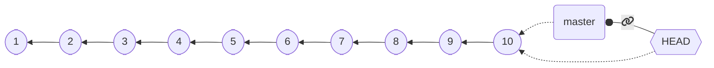

{}
⬇️ `git checkout HEAD~4 && git checkout -b very-important` ⬇️
{}


{}

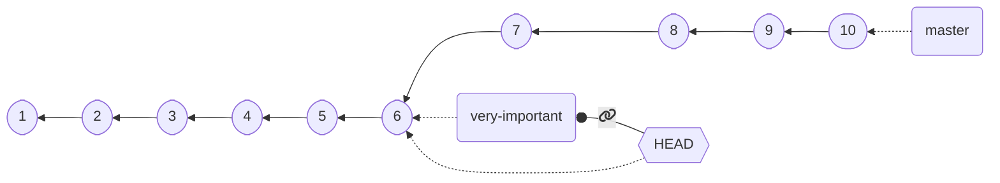

{}

{}
⬇️ Multiple extremely important commits ⬇️
{}

{}

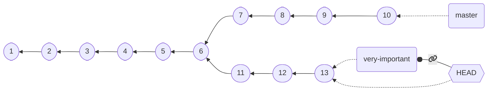
{}

---

## Mining lost commits


{}
⬇️ `git checkout master` ⬇️
{}

{}
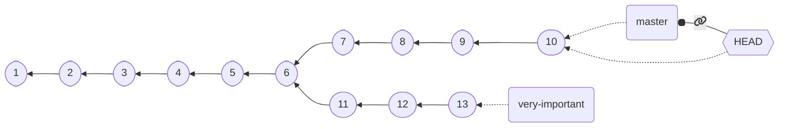
{}

{}
`git branch -D very-important` ➡️
{}

---

## Mining lost commits

⬇️ `git branch -D very-important` ⬇️

{}

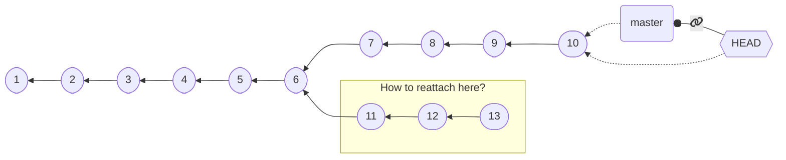

{}

{}

{}

---

## Mining lost commits

### `git reflog`

*Reference logs*: a **diary** of when branches and other references were updated

`git reflog` example:

```text
c5c29c1 (HEAD -> master, origin/master, origin/HEAD) HEAD@{0}: checkout: moving from 2aa2cbd6f5cdb91a02f2061e029106878706bf49 to master
2aa2cbd HEAD@{1}: checkout: moving from master to HEAD~1
c5c29c1 (HEAD -> master, origin/master, origin/HEAD) HEAD@{2}: commit: add git blame
2aa2cbd HEAD@{3}: commit: improve git slides, prepare for blame and reflog
ae7eb17 HEAD@{4}: pull (finish): returning to refs/heads/master
ae7eb17 HEAD@{5}: pull (pick): improve the style
d2b71b0 HEAD@{6}: pull (start): checkout d2b71b04466d11498fdd10cc57da98dc0ab8eae2
e77f8a0 HEAD@{7}: commit: improve the style
5339051 (tag: 0.1.0-2022-09-08T174231) HEAD@{8}: commit: fix: forcibly set the targetPath of hugo
e5eeecd (tag: 0.1.0-2022-09-08T173405) HEAD@{9}: commit: ci: fix JamesIves/github-pages-deploy-action parameter names
50c5efe (tag: 0.1.0-2022-09-08T172922) HEAD@{10}: commit: fix: set up the custom css path
ba8fae0 (tag: 0.1.0-2022-09-08T162354) HEAD@{11}: commit: fix: make the new template work
8546a6c HEAD@{12}: commit: chore: switch to @cric96 fork of hugo-reveal
```

format: `hash (labels) reference: operation (status): details`

Any of the `tree-ish`es can be used to checkout!

`git checkout HEAD@{6}` would checkout commit `d2b71b0`!

---

### `git reflog`


---

## Git Hooks

Scripts that execute when some events happen, stored in `.git/hooks`

They are **not part of the repository code**, and hence **they cannot get commited and pushed**

Events also dictate the file names:
* `applypatch-msg`
* `commit-msg` $\Leftarrow$ particularly useful to enforce a commit message format!
* `fsmonitor-watchman`
* `pre-applypatch`
* `pre-commit`
* `pre-merge-commit`
* `pre-push`
* `pre-rebase`
* `pre-receive`
* `prepare-commit-msg`
* `post-update`
* `push-to-checkout`
* `update`                                                                  

